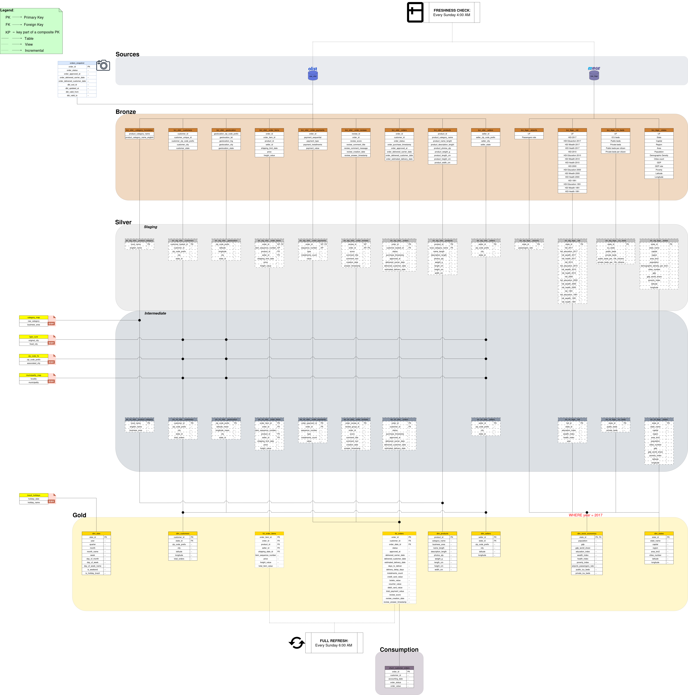

# 🛒 Brazilian E-Commerce & Socioeconomic Context

> An end-to-end **dbt + DuckDB** pipeline that models **how the socioeconomic context of a Brazilian state shapes the e-commerce experience of the people who live there** — built on the Medallion architecture, orchestrated with Dagster, and shipped through a Slim/Full CI–CD loop.


---

## The question

**How does the socioeconomic context of a Brazilian state shape the e-commerce experience of the people who live there?**

Olist, a Brazilian marketplace, released roughly 100k real orders placed between 2016 and 2018. On its own, that data describes *what* people bought and how their deliveries went. To ask *why* the experience differs across the country, this project joins it with public socioeconomic indicators published by **IBGE** — the Brazilian Institute of Geography and Statistics — at the **state** grain: Human Development Index, demographics, economic output, and healthcare capacity.

The result is an analytics-ready dimensional model in which every order, customer, and seller can be read against the socioeconomic profile of its state. `dim_states` is the conformed dimension that ties commerce to context — and the reason the Gold layer is modelled as a **snowflake** rather than a star.

---

## Architecture at a glance



The pipeline follows a **Medallion architecture**; every layer is a separate schema inside a single DuckDB file.

- **Sources** — Olist (e-commerce) and IBGE (socioeconomic) raw tables, declared in YAML and loaded from CSV by `scripts/data_ingestion.py`.
- **Bronze** — 1:1 typed copies of the sources. No business logic; a stable landing zone.
- **Silver / Staging** — cleaned, cast, and renamed to canonical column names. One Bronze parent per model.
- **Silver / Intermediate** — joins, geolocation resolution, and the socioeconomic enrichment that ties Olist geography to IBGE state indicators.
- **Gold** — the deliverable: a **snowflake dimensional model** (2 facts, 6 dimensions) with `dim_states` as the conformed dimension. This is the last layer of the core pipeline.

A small **consumption** layer sits beyond Gold to demonstrate one downstream use — a feature source for a churn model — and is intentionally outside the scope of the core pipeline.

**Orchestration & automation.** [Dagster](dagster/README.md) turns every dbt node into an asset and rebuilds the warehouse after each merge to `main` (continuous delivery). [GitHub Actions](.github/CICD.md) gates every pull request with a Slim or Full CI build and keeps the reference dbt manifest in sync.

---

## Tech stack

| Tool | Role |
|---|---|
| [dbt Core](https://docs.getdbt.com/) | Transformations, tests, documentation, lineage |
| [DuckDB](https://duckdb.org/) | Local analytical engine — single file, no cloud |
| [Dagster](https://dagster.io/) | Orchestration and continuous delivery |
| [GitHub Actions](https://docs.github.com/actions) | Slim/Full CI and the post-merge CD trigger |
| [ngrok](https://ngrok.com/) | Exposes the local Dagster instance so GitHub Actions can reach it for the CD trigger |
| [Python 3.12](https://www.python.org/) | Language for the ingestion and orchestration code |

Data is explored with any DuckDB client (for example [DBeaver](https://dbeaver.io/) or the DuckDB CLI).

---

## Repository map

The depth lives in the layer READMEs; this is the front door.

```
.
├── warehouse/        # dbt project: models, seeds, snapshots, tests, macros
├── dagster/          # Dagster orchestration + continuous delivery
├── .github/          # CI/CD workflows and the dbt-manifest loop
├── scripts/          # data_ingestion.py (ingest), dagster_trigger.py (CD)
├── data/             # gitignored — raw CSVs + the DuckDB database
├── images/           # architecture and lineage diagrams
├── STYLE_GUIDE.md    # SQL / YAML / Python conventions
└── CONTRIBUTING.md   # git workflow + local development setup
```

| Read this | For |
|---|---|
| [`warehouse/README.md`](warehouse/README.md) | Layer-by-layer model design, the dimensional model, seeds, snapshots, tests, the quality audit |
| [`dagster/README.md`](dagster/README.md) | How dbt nodes become assets, the jobs and schedules, the failure sensor |
| [`.github/CICD.md`](.github/CICD.md) | The Slim/Full CI gate, the CD trigger, and the self-correcting manifest loop |
| [`STYLE_GUIDE.md`](STYLE_GUIDE.md) | SQL, YAML, and Python conventions |
| [`CONTRIBUTING.md`](CONTRIBUTING.md) | Branching model, commit/PR conventions, four-terminal local setup |

---

## Quickstart

**Prerequisites:** Python 3.12+, Git, and a Kaggle account to download the datasets.

```bash
# 1. Clone and enter the repo
git clone https://github.com/LorenzoFioravanti94/brazil-ecommerce-analytics.git
cd brazil-ecommerce-analytics

# 2. Create a virtual environment and install dependencies
python -m venv myvenv
source myvenv/bin/activate          # Windows: myvenv\Scripts\activate
pip install -r requirements.txt
```

Download the data (the CSV files are **not committed** — see [Datasets & licensing](#datasets--licensing)) and place them as:

```
data/raw/
├── olist/   # Brazilian E-Commerce Public Dataset by Olist  (9 CSV files)
└── ibge/    # airports.csv, hdi.csv, icu-beds.csv, states.csv
```

```bash
# 3. Ingest the raw CSVs into the production DuckDB file
DBT_TARGET=prod python scripts/data_ingestion.py

# 4. Build and test the whole pipeline
cd warehouse
dbt deps
dbt build --target prod
```

The build produces `data/duckdb/prod.duckdb` with every layer populated. Point any DuckDB client at that file to explore the `gold` schema.

> dbt defines three DuckDB targets (`dev`, `test`, `prod`). The full target model and the recommended day-to-day `dev` workflow are documented in [`warehouse/README.md`](warehouse/README.md#running-locally); to run Dagster locally, see [`CONTRIBUTING.md`](CONTRIBUTING.md#local-development-setup).

---

## Datasets & licensing

| Dataset | Source | Licence |
|---|---|---|
| Brazilian E-Commerce Public Dataset | [Kaggle — olistbr/brazilian-ecommerce](https://www.kaggle.com/datasets/olistbr/brazilian-ecommerce) (by [Olist](https://olist.com/)) | [CC BY-NC-SA 4.0](https://creativecommons.org/licenses/by-nc-sa/4.0/) |
| Brazilian states — socioeconomic indicators | [Kaggle — thiagobodruk/brazilianstates](https://www.kaggle.com/datasets/thiagobodruk/brazilianstates), compiled from [IBGE](https://www.ibge.gov.br/) | [CC0 1.0](https://creativecommons.org/publicdomain/zero/1.0/) |

In line with the Olist licence (non-commercial, share-alike):

- the raw CSV files are **not committed** to this repository — download them from the sources above;
- this project is strictly **non-commercial**.

The **code** in this repository (dbt models, Python, configuration) is released under the **MIT License** — see [`LICENSE`](LICENSE). The MIT License covers the code only; each dataset remains under its own terms.

---

## Author

**Lorenzo Fioravanti** — Analytics Engineer, Barcelona, Spain
[LinkedIn](https://www.linkedin.com/in/lorenzo-fioravanti-177ba7303/) · [GitHub](https://github.com/LorenzoFioravanti94)
