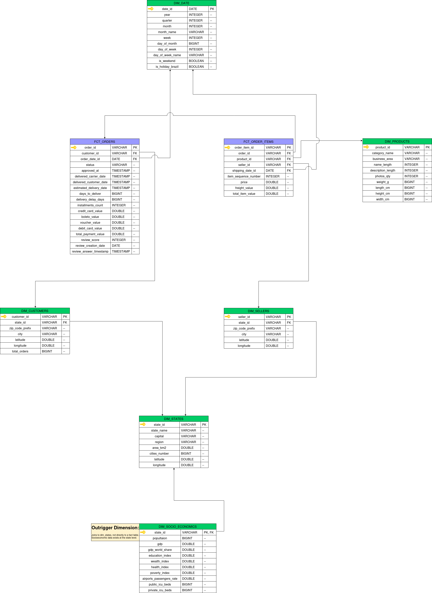

# warehouse

dbt Core project that transforms the raw Olist and IBGE datasets into an analytics-ready dimensional model. All transformations run against a local DuckDB file; no cloud platform is required.

---

## Layer Breakdown

The pipeline follows a Medallion architecture with five layers, each living in its own DuckDB schema.

### Sources (`models/1_sources/`)

Declared in `_src_olist.yml` and `_src_ibge.yml`. No SQL models — sources are YAML-only declarations that point dbt at the raw tables loaded by `scripts/load_raw.py`.

Two source namespaces:
- **`olist`** — e-commerce transactional data (orders, items, payments, reviews, customers, sellers, products, geolocation)
- **`ibge`** — Brazilian government socioeconomic data (states, HDI, ICU beds, airports)

### Bronze (`models/2_bronze/`, schema: `bronze`)

1:1 copies of the source tables with light type casting. No business logic.  
Materialized as **tables** to create a stable, typed landing zone that downstream layers can always reference even when the raw schema is being reloaded.

### Silver — Staging (`models/3_silver/1_staging/`, schema: `silver_staging`)

Cleaned and typed views. Each model has exactly one upstream Bronze source.  
Responsibilities: trim whitespace, normalize casing, cast data types, rename columns to canonical names.  
Materialized as **views** — no extra storage cost; staging is thin.

### Silver — Intermediate (`models/3_silver/2_intermediate/`, schema: `silver_intermediate`)

Business logic, joins, and denormalization. Each model is allowed to reference multiple staging models.  
Responsibilities: join geolocation to customers and sellers, resolve the customer-basket ambiguity, aggregate geolocation to zip-code grain, enrich products with category mappings.  
Materialized as **views**.

### Gold (`models/4_gold/`, schema: `gold`)

Snowflake dimensional model. All Gold models are materialized as **tables** for query performance.  
Two fact tables and six dimension tables (see [Dimensional Model](#dimensional-model) below).  
`fct_orders` and `fct_order_items` are **incremental** to avoid full rebuilds on large datasets.

### Consumption (`models/5_consumption/`, schema: `consumption`)

Use-case-specific marts built on top of the Gold snowflake. Kept outside the Gold layer so the conformed dimensional model stays use-case-agnostic.

Current model: `order_delivery_experience` — an order-grain feature/target source for the downstream delivery-experience ML project. It is materialized as a `table`, has `access: public`, and carries an enforced contract (column names and data types are guaranteed). See [Exposures](#exposures) below.

---

## Dimensional Model

The Gold layer implements a **Snowflake Schema** (not a Star Schema). Shared dimensions — particularly geography — are normalized into `dim_states` rather than denormalized into every fact or dimension that needs state data. This avoids redundancy at the cost of one extra join for queries that need it.



`fct_order_items` (grain: one row per item in an order) references `fct_orders` (grain: one row per order) via `order_id`. This fact-to-fact join surfaces order-level measures on the item grain without denormalizing them.

`dim_states` is the shared conformed dimension: `dim_customers`, `dim_sellers`, and `dim_socio_economics` all carry a `state_id` FK that resolves here.

---

## Macros

### `generate_schema_name`

Overrides dbt's default schema-name generation so that a model's `+schema` config is used as-is, without the `{target_name}_{schema}` prefix dbt would otherwise apply.

This is safe because environment isolation in this project happens at the DuckDB **file** level (separate `.duckdb` files per target), not at the schema level. The override prevents schema names like `dev_gold` or `prod_gold` from appearing.

### `show_target`

Developer utility that prints the active target's connection details to the console.  
Usage: `dbt run-operation show_target`

---

## Seeds

Static reference and mapping data loaded into the `seeds` schema.

| Seed | Purpose |
|---|---|
| `brazil_holidays` | Brazilian national holidays; joined to `dim_date` to flag holiday dates |
| `category_map` | Maps raw Olist product category names to curated business areas |
| `municipality_map` | Maps district/locality names to their official IBGE municipality |
| `typo_cure` | Corrects misspelled city names to their canonical spelling |
| `zip_code_fix` | Overrides the city associated with problematic zip code prefixes |

The four city/geography seeds (`municipality_map`, `typo_cure`, `zip_code_fix`, `category_map`) solve data quality issues in the raw Olist data that cannot be fixed at source. They are applied in the Silver intermediate layer during geolocation resolution.

---

## Snapshots

A single snapshot is defined: **`orders_snapshot`** (schema: `snapshots`).

It captures changes to the `orders` source table using `strategy: check` (not `timestamp`), because the Olist source has no single reliable `updated_at` column. The checked columns are `order_status`, `order_approved_at`, `order_delivered_carrier_date`, and `order_delivered_customer_date`.

`orders` is the only Olist table with genuine SCD Type 2 semantics — order status transitions through a lifecycle (created → approved → shipped → delivered, or cancelled). All other Olist tables are static reference data with no meaningful row-level history.

The dataset used here is a static Kaggle dump, so the snapshot does not capture live mutations in practice. The configuration is nonetheless production-ready: pointed at a live source, it would track every status transition over time.

---

## Tests

Tests are organized into three directories under `tests/`.

### Generic tests (`tests/generic/`)

Reusable macros invoked via YAML configuration:
- `test_mean_consistency` — asserts that the mean of a numeric column falls within an expected range
- `test_ratio_consistency` — asserts that the ratio between two columns stays within bounds

### Consistency tests (`tests/consistency/`)

Cross-table row-count and aggregate consistency checks:
- `assert_gld_payment_breakdown_matches_total` — payment type columns must sum to `total_payment_value`
- `assert_gld_total_item_value_equals_price_plus_freight` — `total_item_value` must equal `price + freight_value`
- `assert_slv_stg_ibge__icu_beds_sum_consistency` — ICU bed counts must be consistent across aggregation levels

### Business rules tests (`tests/business_rules/`)

Domain-logic assertions:
- `assert_gld_delivery_date_after_purchase` — delivered orders must have a delivery date after the purchase date

### Unit tests (`models/4_gold/_gld__unit_tests.yml`)

Hermetic unit tests on Gold models that run against inline SQL fixtures (not the database). They verify transformation logic in isolation, without requiring a full dbt build. Use `dbt test -s test_type:unit` to run only unit tests.

---

## Exposures

One exposure is defined: **`delivery_experience_model`** (type: `ml`, maturity: `low`).

It consumes `order_delivery_experience` as its order-grain feature source. The planned model predicts delivery duration (`days_to_deliver`, regression) and lateness (derived from `delivery_delay_days`), studying how the socioeconomic context of a customer's state shapes the delivery outcome.

`order_delivery_experience` is hardened as a data product:
- `access: public` — explicitly exposed to downstream consumers
- `contract: enforced: true` — column names and data types are guaranteed by the contract
- Materialized as a `table` — downstream ML reads a stable, pre-computed relation

---

## Quality Audit

This project was audited with [`dbt-labs/dbt_project_evaluator`](https://hub.getdbt.com/dbt-labs/dbt_project_evaluator/latest/) v1.3.1. The package was installed on a dedicated branch, run against the `dev` target only, and removed after the audit (audit-and-strip strategy).

The initial run produced 7 findings (all `warn`). After applying fixes, 5 remain — each a documented design exception.

| Finding | Count | Disposition |
|---|---:|---|
| `model_naming_conventions` | 38 | Exception — intentional Medallion prefix convention (`brz_`, `slv_stg_`, etc.) |
| `source_directories` | 13 | Exception — sources are centralized under `models/1_sources/` by design |
| `sources_without_freshness` | 11 | Exception — static Kaggle dump; no row-level load-time column exists |
| `missing_primary_key_tests` | 14 | Partial exception — Bronze (no PK by design) + raw-grain geolocation staging |
| `valid_test_coverage` | 1 | Derived — a consequence of the documented Bronze + geolocation exceptions |
| `exposure_parents_materializations` | 0 | Fixed — exposure parent materialized as a table |
| `exposures_dependent_on_private_models` | 0 | Fixed — exposed model set to `access: public` |

The aim is not a perfect score but documented, deliberate handling of every finding. Each exception above is a design decision, not an oversight.

---

## Running Locally

From the `warehouse/` directory with the virtual environment active:

```bash
# Verify the DuckDB connection
dbt debug

# Build and test everything
dbt build

# Run a single model and its upstream dependencies
dbt build -s +dim_customers

# Run only unit tests (no database required)
dbt test -s test_type:unit

# Run tests on a specific layer
dbt test -s tag:gold

# Print the active target's connection details
dbt run-operation show_target
```

The project's `profiles.yml` is committed in `warehouse/`, so dbt discovers it automatically and a fresh clone needs no `~/.dbt` setup. It defines three targets, all DuckDB:

| Target | Path | Notes |
|---|---|---|
| `dev` (default) | `data/duckdb/dev.duckdb` | Throwaway build DB. Attaches `prod` read-only (alias `prod`) so dev queries can read production data without writing to it. |
| `test` | `data/duckdb/test.duckdb` | Used by CI — a clean, isolated database built from scratch on every run. |
| `prod` | `data/duckdb/prod.duckdb` | The persistent production database; the one Dagster builds on each deploy. |

All three DuckDB files live under `data/duckdb/` (gitignored) and are addressed by paths relative to `warehouse/`, so the project runs identically on Windows, macOS, and Linux.

Environment isolation is at the **file** level (separate `.duckdb` files per target), which is what makes the `generate_schema_name` override safe — see [Macros](#macros).
